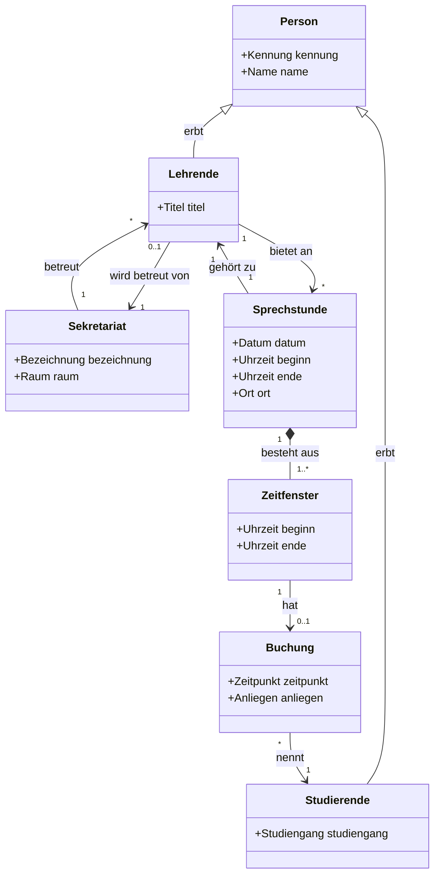

# UML-Klassendiagramm nach Regeln für Datenmodelle

```mermaid
classDiagram
    class Person {
        +Kennung kennung
        +Name name
    }

    class Lehrende {
        +Titel titel
    }

    class Studierende {
        +Studiengang studiengang
    }

    class Sekretariat {
        +Bezeichnung bezeichnung
        +Raum raum
    }

    class Sprechstunde {
        +Datum datum
        +Uhrzeit beginn
        +Uhrzeit ende
        +Ort ort
    }

    class Zeitfenster {
        +Uhrzeit beginn
        +Uhrzeit ende
    }

    class Buchung {
        +Zeitpunkt zeitpunkt
        +Anliegen anliegen
    }

    Person <|-- Lehrende : erbt
    Person <|-- Studierende : erbt

    Lehrende "1" --> "*" Sprechstunde : bietet an
    Sprechstunde "1" --> "1" Lehrende : gehört zu

    Sprechstunde "1" *-- "1..*" Zeitfenster : besteht aus

    Zeitfenster "1" --> "0..1" Buchung : hat

    Buchung "*" --> "1" Studierende : nennt

    Sekretariat "1" --> "*" Lehrende : betreut
    Lehrende "0..1" --> "1" Sekretariat : wird betreut von
```
