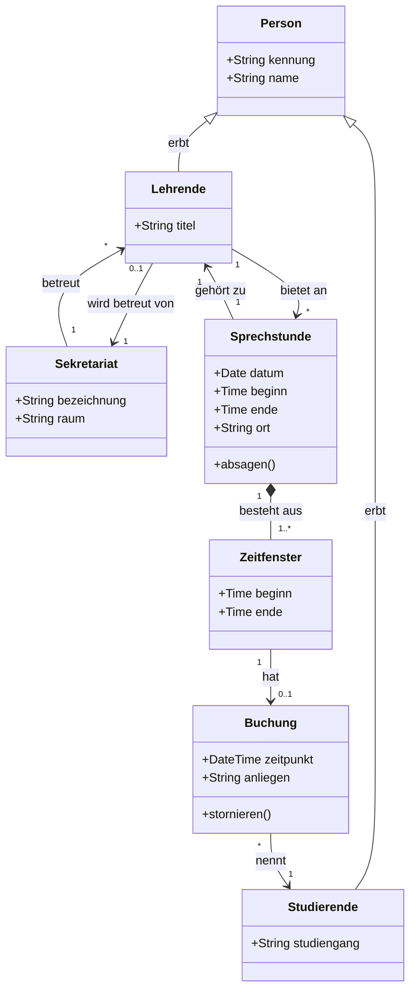

# UML-Klassendiagramm für Beschreibung 3

```mermaid
classDiagram
    class Person {
        +String kennung
        +String name
    }

    class Lehrende {
        +String titel
    }

    class Studierende {
        +String studiengang
    }

    class Sekretariat {
        +String bezeichnung
        +String raum
    }

    class Sprechstunde {
        +Date datum
        +Time beginn
        +Time ende
        +String ort
        +absagen()
    }

    class Zeitfenster {
        +Time beginn
        +Time ende
    }

    class Buchung {
        +DateTime zeitpunkt
        +String anliegen
        +stornieren()
    }

    Person <|-- Lehrende : erbt
    Person <|-- Studierende : erbt

    Lehrende "1" --> "*" Sprechstunde : bietet an
    Sprechstunde "1" --> "1" Lehrende : gehört zu

    Sprechstunde "1" *-- "1..*" Zeitfenster : besteht aus

    Zeitfenster "1" --> "0..1" Buchung : hat

    Buchung "*" --> "1" Studierende : nennt

    Sekretariat "1" --> "*" Lehrende : betreut
    Lehrende "0..1" --> "1" Sekretariat : wird betreut von
```
