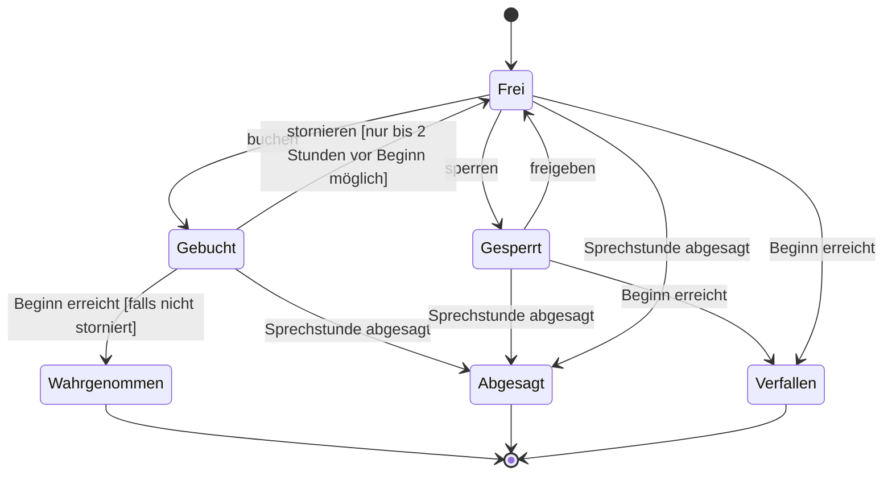

```mermaid
stateDiagram-v2
  
  
        [*] --> Frei
        Frei --> Gesperrt : sperren
        Gesperrt --> Frei : freigeben
        Frei --> Gebucht : buchen
        Gebucht --> Frei : stornieren [nur bis 2 Stunden vor Beginn möglich]
        Gebucht --> Wahrgenommen : Beginn erreicht [falls nicht storniert]
        Gebucht --> Abgesagt : Sprechstunde abgesagt
        Gesperrt --> Abgesagt : Sprechstunde abgesagt
        Frei --> Abgesagt : Sprechstunde abgesagt
        Gesperrt --> Verfallen : Beginn erreicht
        Frei --> Verfallen : Beginn erreicht
        
    Wahrgenommen --> [*]
    Abgesagt --> [*]
    Verfallen  --> [*]
```